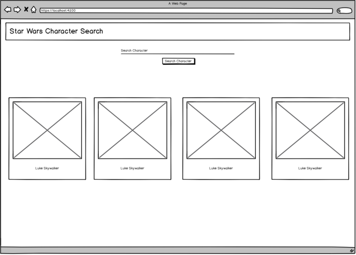

# Coding Challenge

## Star Wars Character Search

Your task is to allow the user of your app to query for any character from the Star Wars movies by name.

You should query the open Star Wars API depending on the user input, store the data in a state variable and display it

Your page should something like the following:

